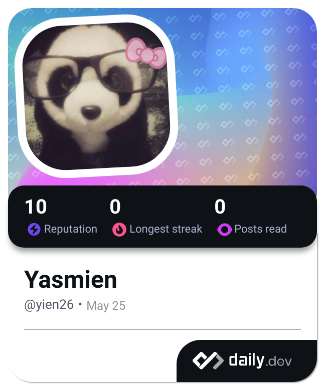

<a name="readme-top">

<br/>

<br />
<div align="center">
  <a href="https://github.com/zyx-0314/">
  <!-- TODO: If you want to add logo or banner you can add it here -->
    
  </a>
<!-- TODO: Change Title to the name of the title of your Project -->
  <h3 align="center">Portfolio</h3>
</div>
<!-- TODO: Make a short description -->
<div align="center">
  A Portfolio showcasing my works
</div>

<br />

<!-- TODO: Change the zyx-0314 into your github username  -->
<!-- TODO: Change the WD-Template-Project into the same name of your folder -->


---

<br />
<br />

<!-- TODO: If you want to add more layers for your readme -->
<details>
  <summary>Table of Contents</summary>
  <ol>
    <li>
      <a href="#overview">Overview</a>
      <ol>
        <li>
          <a href="#key-components">Key Components</a>
        </li>
        <li>
          <a href="#technology">Technology</a>
        </li>
      </ol>
    </li>
    <li>
      <a href="#rule,-practices-and-principles">Rules, Practices and Principles</a>
    </li>
    <li>
      <a href="#resources">Resources</a>
    </li>
  </ol>
</details>

---

## Overview

<!-- TODO: To be changed -->
<!-- The following are just sample -->
Project Description:

What is the project?
- It's a portfolio website designed to showcase personal or professional work, skills, and achievements.

What's the purpose?
- The main purpose is to create an online presence that highlights accomplishments and capabilities, serving as a digital resume or portfolio.


What are key components?

- MultiPage Website: Structured into multiple pages, each dedicated to showcasing different aspects (e.g., projects, skills).

What technology is used and how is it used?
- HTML: Defines the structure of each page, including headers, paragraphs, images, etc.
- CSS: Styles elements such as fonts, colors, layout, and responsive design to ensure the website looks professional and is easy to navigate.

### File Structure Explanation:

- index.html: Main landing page of the website.
- style.css: Directory containing CSS files for styling.
- img: For storing project images and icons.

### Deployment Instructions:

- Go to my repository: https://github.com/yien26/WD-FinalProject-Cordero
Go to actions and select the deploy link.

- Or click this instead: https://yien26.github.io/WD-FinalProject-Cordero/

### Project repositories:
Note: This can also be viewed in the portfolio website

Seatwork 2: [https://yien26.github.io/WD-Seatwork-2-Cordero-main/index.html"]

Headers&Footers: [https://yien26.github.io/WD-Seatwork3-Cordero/index.html]

Feature Page: [https://yien26.github.io/WD-Seatwork4-Cordero/index.html]

Hands On 1: [https://yien26.github.io/WD-Cordero---Hands-On/]

Hero Gallery: [https://yien26.github.io/WD-Cordero-HandsOn2/index.html]

### WakaTime Integration:

View my coding stats on WakaTime: [\[My Profile Link\]](https://wakatime.com/@Yien)

### Technology
<!-- TODO: List of Technology Used -->


## Rules, Practices and Principles
1. Always use `WD-` in the front of the Title of the Project for the Subject followed by your custom naming.
2. Do not rename any .html files; always use `index.html` as the filename.
3. Place Files in their respective folders.
4. All file naming are in camel case.
   - Camel case is naming format where there is no white space in separation of each words, the first word is in all lower case while the succeding words first letter are in upper followed by lower cased letters.
   - ex.: buttonAnimatedStyle.css
5. Use only `External CSS`.
6. Renaming of Pages folder names are a must, and relates to what it is doing or data it holding.
7. File Structure to follow below.

```
WD-ProjectName
└─ assets
|   └─ css
|   |   └─ style.css
|   └─ img
|   |   └─ fileWith.jpeg/.jpg/.webp/.png
|   └─ js
|       └─ script.js
└─ pages
|  └─ pageName
|     └─ assets
|     |  └─ css
|     |  |  └─ style.css
|     |  └─ img
|     |  |  └─ fileWith.jpeg/.jpg/.webp/.png
|     |  └─ js
|     |     └─ script.js
|     └─ index.html
└─ index.html
└─ readme.md
```

## Resources

<!-- TODO: Add References -->
| Title | Purpose | Link |
|-|-|-|
| Pinterest | Used as reference | pinterest.com |
| W3Schools | Used as reference | www.w3schools.com |
